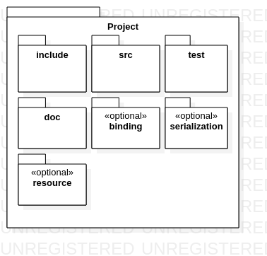

# C++ Style Guide and Coding Rules

## Introduction

> "Code is **read much** **more** often than it is **written**"

### Why starting this document with this citation ?

This quote illustrate exactly the intent of this document. We all spend much more time on reading the code written by ourselves and others than actually writting code. Writting code itself is a simple task, a few symbol can make so much work but, is it really that easy to understand ? Spoiler, it is not. Writting clean code is one of the hardest thing in development, everyone has his opinion about what is clean code. Great books \(I have not read yet BTW\) is written to discuss good and bad practices but we won't cover this topic specifically because we won't do it as well as those who wrote these book because they are way more experinced than most of us on this topic. Clean code is not only about how to write code but also about how intuitive your code is, how readable your code is or how easy browsable  your project is.

### How to read this document

This document will describe the structure of a FD Project within different granularities. We will start at the project level by describing the folder structure. Then we will get into more and more details to end up describing the code itself.

## Folder structure

Every FD project is structured the same way:

* An **include** directory containing the header files
* A **src** directory containing the source files
* A **test** directory, the test are based on _GoogleTest_
  * An unit\_test directory containing the unit test files
  * An integration\_test directory containing the integration test files
* A **doc** directory containing the documentation of the project. The project documentation is written in _markdown_ and code documentation is made directly into the code using _doxygen_. Uml diagrams are made with _staruml and diagrams are exported into png format to be embedded into the markdown documentation_
* An optional **binding** directory containing cross language binding \(if any\) for the project
* An optional **serialization** directory containing the serialization code files
* An optional **resource** directory for the resources. Large resource files must be tracked using git lfs to keep performances



Additionnaly FD Projects are developped using _Visual Studio Code_ therefore there is a **.vscode** directory. As each FD Project must be buildable by itself \(within its dependencies obviously\), they also contains several files :

* A **LICENCE** file, currently FD Projects are under _Apache 2 Licence_
* A **.gitignore** file to specify to files to ignore
* A **.clangformat** file to configure the formating of the code, basically this file is the same for all FD Project
* A **CMakeLists.txt** file to build the project
* A **README.md** describing the project within a few words and pointing on the documentation main page

### Modules subdirectories

Most of the FD Projects contains several modules. Each modules **must** be into a dedicated folder into **include**, **src** and **test**. Each module **should** be properly documented and diagrams are highly recommended to describe both the structure and the behavior of the module. Modules may contain submodules, every rules on modules **must** be applied submodules.

Module folders naming must be in PascalCase, as short as possible and self-descriptive. While naming a module **try not to use accronyms**, if you use them **do not use uppercase notation**. Accronyms must be in PascalCase in order to respect the naming convention and increase readability.

> "An **example** is worth a **thousand words**"

In the following examples we will see several situations

```text
// Example #1
HTTPServerMGT // Bad naming

HttpServerManagement // Prefer this one

// Example #2
RGBCLRID // Very Bad naming

RgbColorId // Prefer this one
```

In _Example \#1_, at  first sight we are not sure if the accronym is HTTP or HTTPS. Then even though MGT might seem obvious for some people I will never be clearer than Management

In _Example \#2_, where does the Accronyms ends ? Some of you might have guessed it on first sight but RGB, CLR and ID mixed altogether with no separator and no case delimitation is really hard to read efficiently. Plus MGT from the previous example and CLR have the same problem. Do not trade readability for lazyness, Color is not that common of an accronym. Prefer using the word rather than non trivial accronyms.

## Code Structure

Before diving into how to actually write the code let's dicuss about how the code is structured and how the development process should be done. First I would start again with two quotes:

> "Think twice, code once"  
> "Keep it simple stupid"

Why these two? Aren't they opposed?

They are not! It does not take that much effort to write complicated code that does not perform that much work. Clearly, writting clen code as we have seen previously is an extremely hard task. That being said, as we do not want to rewrite the code many, many, many, many, ..., many times, we need to pay high attention on what we want to acheive and how we are going to acheive it.

_As a developer, as soon as I find a project idea I just dive into the code before thinking about anything else than how to do it in C++. Then when I achieve my short term goal and try to scale up to a larger scope I just crash into the **spagetti** plate where my project ends up being more and more messy. Once you've reached this area, it's **Game Over**. All you have to do is reboot the project and try not to repeat your self into the same situation._

What about the KISS principle ?

As we write the code not to rewrite it once it work, we have to keep in mind that when we will face it again we will not remember why we wrote it the way we did. That means when we will face it again ignoring almost everything about it, **the simpler it will be the easier we will work** with it.

To keep the code as simple as possible we will try to make the compromise between efficiency and readability. Every piece of code has it "target performance" but you cannot know how efficient it is until you've  monitored it. **Do not anticipate** on performances and do not invest into **premature optimizations**. Optimize only when it is **necessary**. Use meaningful names, indent your code properly, do not hesitate to add blank lines to separate things. Templates and metaprogramming must be used very carefully, do not use it if it is not **required**.

 


